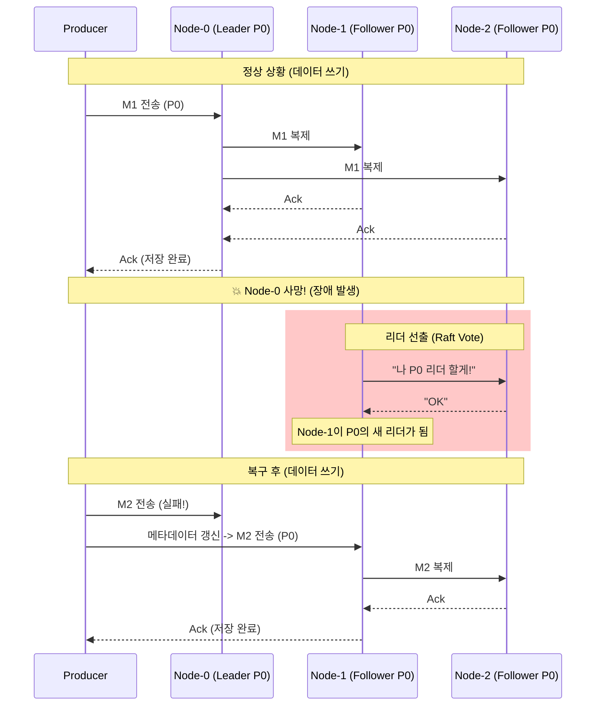

# Redpanda/Kafka 심층 시나리오 분석: 데이터 흐름과 장애 복구

**작성일:** 2026-01-20
**환경:** 3-Broker, 3-Partition, 3-Replica
**목표:** 데이터 분산 저장 원리와 장애 발생 시 자동 복구 메커니즘의 완벽한 이해.

---

## 1. 아키텍처 및 초기 상태 (Setup)

### 1.1 클러스터 구성 (3-Node)
*   **Node-0:** P0(Leader), P1(Follower), P2(Follower)
*   **Node-1:** P1(Leader), P2(Follower), P0(Follower)
*   **Node-2:** P2(Leader), P0(Follower), P1(Follower)
> *모든 노드가 모든 데이터를 가짐. 단지 '누가 리더냐'만 다름.*

### 1.2 클라이언트 구성
*   **Producer:** 메시지 10개 (`M1` ~ `M10`) 발행.
*   **Consumer Group (MyService):**
    *   **Consumer A:** P0, P1 담당 (2개 처리)
    *   **Consumer B:** P2 담당 (1개 처리)
> *파티션은 3개인데 소비자가 2명이므로, 한 명이 파티션 2개를 맡아야 함.*

---

## 2. 시나리오 1: 정상 데이터 흐름 (Normal Operation)

### 2.1 데이터 생산 (Produce)
Producer가 메시지 10개를 보냅니다. (Key가 없으면 라운드 로빈으로 분배됨)

| 메시지 | 파티션 | 저장 위치 (Leader) | 복제 (Followers) |
| :--- | :--- | :--- | :--- |
| **M1** | **P0** | **Node-0** | Node-1, Node-2로 복사 |
| **M2** | **P1** | **Node-1** | Node-0, Node-2로 복사 |
| **M3** | **P2** | **Node-2** | Node-0, Node-1로 복사 |
| **M4** | **P0** | **Node-0** | ... |
| ... | ... | ... | ... |

**[저장 로직]**
1.  Producer -> Node-0 (P0 Leader)에게 `M1` 전송.
2.  Node-0은 메모리/디스크에 `M1` 기록.
3.  동시에 Node-1, Node-2에게 `M1`을 보냄 (Raft AppendEntries).
4.  과반수(2개 노드 이상)가 저장 완료하면 Producer에게 "성공(Ack)" 응답.

### 2.2 데이터 소비 (Consume)
Consumer Group `MyService`가 데이터를 가져갑니다.

*   **Consumer A:**
    *   **P0 연결:** Node-0에게 접속하여 `M1, M4, M7, M10`을 가져감.
    *   **P1 연결:** Node-1에게 접속하여 `M2, M5, M8`을 가져감.
*   **Consumer B:**
    *   **P2 연결:** Node-2에게 접속하여 `M3, M6, M9`를 가져감.

> **핵심:** 컨슈머는 오직 **리더 노드**하고만 통신합니다. 팔로워들은 그저 백업용으로 조용히 데이터만 동기화하고 있습니다.

---

## 3. 시나리오 2: 노드 장애 및 자동 복구 (Failover)

### 3.1 상황 발생: Node-0 (P0의 리더) 사망 💥
*   **영향:**
    *   **P0 파티션:** 리더가 사라짐. 쓰기/읽기 일시 중단.
    *   **P1, P2 파티션:** 리더(Node-1, Node-2)가 살아있으므로 영향 없음. (단, 백업본 하나가 줄어듦)

### 3.2 리더 선출 (Leader Election)
Node-0이 죽은 것을 감지한(Heartbeat 끊김) 즉시, P0의 팔로워들(Node-1, Node-2)이 **투표**를 시작합니다.

1.  **Node-1:** "나 P0 리더 할래! 데이터 다 있어."
2.  **Node-2:** "그래, 너 해." (동의)
3.  **결과:** **Node-1이 P0의 새로운 리더**로 승격됩니다.

### 3.3 클라이언트 복구 (Metadata Update)
1.  **Consumer A:** Node-0(옛 리더)에게 데이터 달라고 요청했다가 실패(Timeout/Connection Refused).
2.  **메타데이터 갱신:** Consumer A는 다른 살아있는 브로커에게 "P0 리더 누구야?"라고 물어봅니다.
3.  **응답:** "이제부터 Node-1이 P0 리더야."
4.  **재접속:** Consumer A는 **Node-1**에게 접속하여 중단된 지점부터 다시 데이터를 읽습니다.

> **데이터 유실 여부:**
> `Replication Factor=3`이고 `min.insync.replicas=2` (또는 Raft 과반수) 설정이 되어 있다면, Node-0이 죽기 직전에 받은 데이터는 이미 Node-1에도 저장되어 있었으므로 **유실은 0건**입니다.

---

## 4. 시각화 (Diagram)

이 시나리오는 Redpanda와 Kafka 모두 동일한 개념으로 동작하며, Redpanda는 Raft 알고리즘 덕분에 이 **리더 선출 과정이 훨씬 빠릅니다.**
